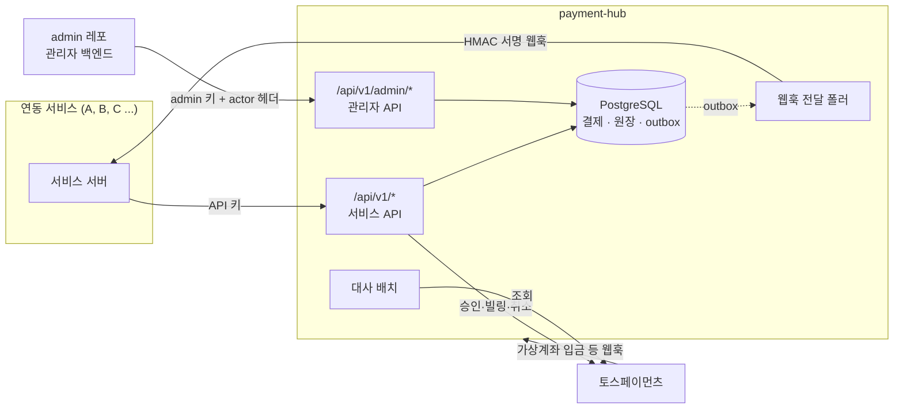
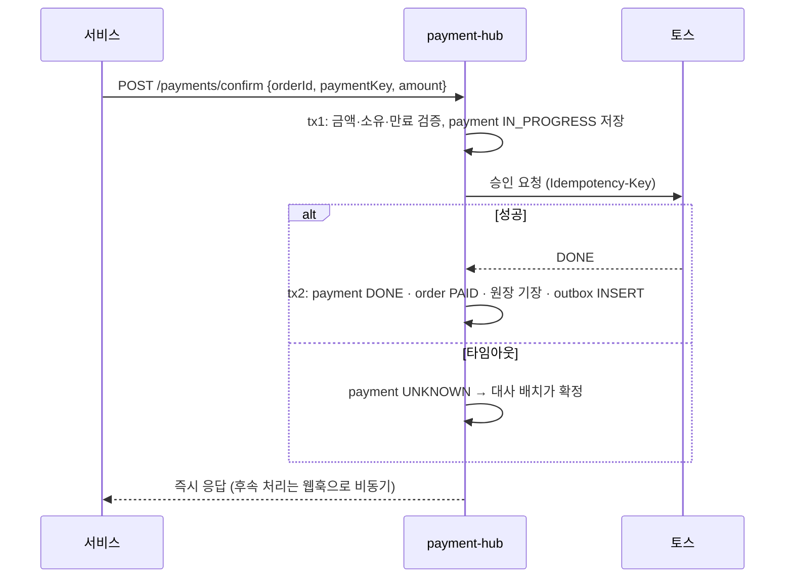
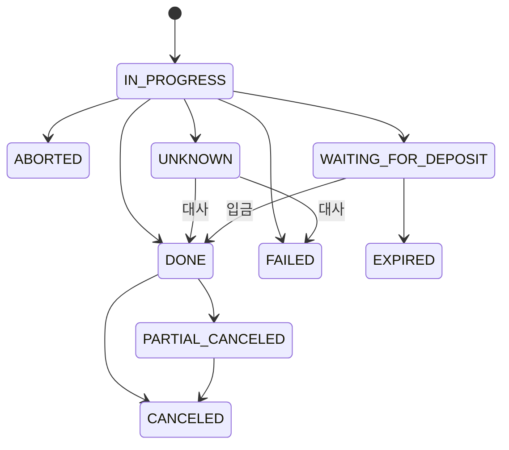

# payment-hub

> 여러 서비스의 결제를 하나로 모으는 **결제 허브 서버**
> 토스페이먼츠 연동 · 결제 이력 · 복식부기 원장 · 결제 이벤트 전달을 한 곳에서 책임진다.


## 한눈에 보기

- **무엇을**: 여러 서비스가 공유하는 결제 서버. 토스페이먼츠 일반 결제·빌링(자동결제)·가상계좌, 환불, 복식부기 원장, 서비스로의 결제 이벤트 웹훅
- **규모**: 테이블 17개 · API 43개 (서비스 15 · 관리자 27 · 토스 웹훅 수신 1) · 테스트 약 530개 (단위 260 · 실제 PostgreSQL 통합 274)
- **검증 방식**: 토스는 목 대신 **실제 HTTP로 응답하는 가짜 토스 서버**로 인증 헤더·타임아웃·에러 분류까지 확인. 엔티티↔스키마 적합성 테스트로 코드와 DB가 어긋나지 않게 유지
- **한계**: 실제 토스 키로는 아직 연동하지 않았다 (공식 문서 규격의 가짜 토스 서버로 검증)

## 해결한 문제

결제 서버에서 실제로 돈이 새거나 기록이 틀어지는 지점과, 각각을 막은 방식·근거다. 설계 설명은 [설계 상세](#설계-상세)에.

| 문제 | 해결 | 근거 |
|---|---|---|
| PG 타임아웃 — 돈은 나갔는데 hub엔 기록이 없거나 "실패"로 잘못 기록됨 | 토스 호출 **전에** `IN_PROGRESS` 선기록, 결과를 모르면 실패가 아니라 `UNKNOWN` → 대사 배치가 토스 조회로 확정 (응답이 결제와 안 맞으면 확정 안 함) | [payment-confirm](./test/payment/payment-confirm.int-spec.ts) "타임아웃 → 504 PG_TIMEOUT + paymentId, 결제 UNKNOWN" · [payment-reconcile](./test/payment/payment-reconcile.int-spec.ts) |
| 동시 요청·재시도로 인한 이중 결제 | 주문 행 락으로 승인 직렬화, 주문당 살아있는 결제 1건 [부분 유니크 인덱스](./db/schema.sql#L269), 모든 쓰기에 서비스 단위 멱등키 | [payment-confirm](./test/payment/payment-confirm.int-spec.ts) "두 요청이 동시에 승인 전 검증 구간에 있어도 주문 락으로 직렬화된다 (결정적 재현)" · [db-guarantees](./test/schema/db-guarantees.int-spec.ts) "진행 중인 결제가 있는 주문에 결제를 하나 더 만들 수 없다" |
| 한 서비스가 다른 서비스의 결제를 조회·취소 | 모든 쿼리에 인증된 `service_id` 강제 + 주문·결제·취소·빌링키를 `(id, service_id)` [복합 FK](./db/schema.sql#L245)로 연결 — 코드 버그가 있어도 DB가 거부 | [db-guarantees](./test/schema/db-guarantees.int-spec.ts) "다른 서비스의 주문에 결제를 붙일 수 없다" (SQL 직접 실행 → FK 위반) · [order-api](./test/order/order-api.int-spec.ts) "다른 서비스의 주문은 404 ORDER_NOT_FOUND (존재를 숨김)" |
| 원장 금액 불일치·사후 조작 | 차변 합 = 대변 합을 커밋 시점 [제약 트리거](./db/schema.sql#L375)로, UPDATE/DELETE를 [트리거](./db/schema.sql#L400)로 차단. 같은 사건 이중 기장은 유니크 제약으로 불가 | [db-guarantees](./test/schema/db-guarantees.int-spec.ts) "차변 합 ≠ 대변 합이면 커밋 시점에 거부되고 아무것도 남지 않는다", 원장·감사 로그 수정·삭제 거부 · [ledger-transaction](./test/ledger/ledger-transaction.entity.spec.ts) (분개 규칙) |
| 결제는 됐는데 서비스가 이벤트를 못 받음 / 두 번 받음 | 상태 변경과 이벤트를 한 트랜잭션에 저장(Transactional Outbox), `FOR UPDATE SKIP LOCKED` 폴러, HMAC 서명, 지수 백오프 → `DEAD` → 관리자 재전송 | [webhook-dispatch](./test/outbox/webhook-dispatch.int-spec.ts) "워커 두 개가 동시에 돌아도 한 건은 한 번만 보낸다" |
| 깨진 한 건 때문에 배치 전체가 매 틱 멈춤 (poison item) | 대사·웹훅 발송·주문 만료·빌링키 삭제 배치가 건 단위로 실패를 격리하고 그 건을 순서의 뒤로 | [payment-reconcile](./test/payment/payment-reconcile.int-spec.ts) · [webhook-dispatch](./test/outbox/webhook-dispatch.int-spec.ts) "서명 키를 복호화할 수 없는 건이 섞여 있어도 나머지는 보내고, 그 건은 실패로 기록해 재시도한다" |

각 결정을 **왜** 그렇게 했는지는 [CHANGELOG.md](./CHANGELOG.md)에 커밋 단위로 남아 있다.

---

## 왜 만들었나

여러 서비스를 운영하는 조직에서 서비스마다 PG 연동 코드, 키 관리, 결제 이력이 흩어져 있으면 다음 문제가 생긴다.

- **중복 코드**: 서비스마다 같은 PG 승인·취소·조회 코드를 따로 유지
- **상태 불일치**: 타임아웃 등으로 "돈은 나갔는데 기록이 없는" 결제가 서비스마다 다른 방식으로 방치됨
- **응답 지연**: 결제 후 후속 작업(프로비저닝, 알림)이 결제 요청에 동기로 묶임

payment-hub는 **"결제만"** 중앙화한다. 주문 서버를 따로 두지 않고, 주문 도메인은 각 서비스가 들고 허브에는 결제에 필요한 값만 넘긴다.
작은 조직이 주문 서버까지 분리하는 비용은 과하다고 판단했다.

```
대기업형:     서비스 → 주문 서버 → 결제 서버 → 서비스
payment-hub: 서비스(+주문) → payment-hub → 서비스(웹훅)
```

---

## 아키텍처



### 책임 경계 — 허브는 서비스의 비즈니스를 모른다

| payment-hub | 각 서비스 |
|---|---|
| 토스 API 호출, 결제·취소 이력, 원장 기장 | 상품·구독·쿠폰, 금액·할인·환불 금액 계산 |
| 사전 등록 금액 고정, confirm 시 금액 대조 | 정기결제 스케줄·재시도 정책 |
| 범용 결제 이벤트 발행 | 이벤트 수신 후 후속 처리, 실패 시 직접 취소 요청 |

새 서비스 연동은 **서비스 등록 + API 키 발급 + 상품 유형 등록 + PG 자격증명 등록**만으로 끝난다. 서비스별 분기 코드는 없다.

---

## 설계 상세

### 1. 외부 호출 전에 먼저 기록한다 — 결과를 모르면 `UNKNOWN`
토스 호출 전에 `IN_PROGRESS`로 저장하고, DB 트랜잭션 **밖에서** 토스를 호출한 뒤, 결과를 별도 트랜잭션으로 반영한다.
타임아웃이면 `UNKNOWN`으로 남기고 대사 배치가 토스 조회 API로 확정한다.



### 2. 서비스 소유권은 DB가 강제한다
주문·항목·결제·취소·빌링키를 `(id, service_id)` **복합 FK**로 연결한다. 코드 버그가 있어도 서비스 B의 결제가 서비스 A의 주문에 붙을 수 없다.

### 3. append-only 복식부기 원장
- 차변 합 = 대변 합을 **커밋 시점 제약 트리거**로 강제
- 원장 테이블의 UPDATE/DELETE는 트리거로 차단, 정정은 `ADJUSTMENT` 반대 분개로만
- `(transaction_type, reference_type, reference_id)` 유니크로 같은 사건의 이중 기장 불가
- 매출·환불 리포트는 별도 집계 테이블 없이 원장에서 집계

| 사건 | 차변 | 대변 |
|---|---|---|
| 결제 승인 | PG_RECEIVABLE | REVENUE |
| 결제 취소 | REFUND | PG_RECEIVABLE |
| PG 정산 입금 | CASH + PG_FEE | PG_RECEIVABLE |

### 4. 모든 쓰기 요청은 멱등하다
주문 `(service_id, external_order_id)`, 결제 `idempotency_key`(토스 `Idempotency-Key`로도 전달), 취소 `(service_id, idempotency_key)`.
같은 키로 재요청하면 에러가 아니라 기존 결과를 돌려준다. 한 주문에 살아있는 결제는 **부분 유니크 인덱스**로 1건만 허용해 이중 결제를 막는다.

### 5. Transactional Outbox + 신뢰성 있는 웹훅 전달
- 결제 상태 변경과 `tb_outbox_event` INSERT를 한 트랜잭션으로 묶는다
- 폴러가 `FOR UPDATE SKIP LOCKED`로 전달 건을 가져가므로 인스턴스를 여러 개 띄워도 안전하다. `locked_until`로 죽은 워커의 작업을 회수한다
- HMAC 서명, 지수 백오프 재시도, 한도 초과 시 `DEAD` → 관리자 재전송
- 전달 이벤트(불변)와 전달 상태(가변)를 테이블로 분리

### 6. 보안
- 토스 시크릿 키·빌링키·웹훅 서명 키는 암호화(`*_enc bytea` + `*_key_id`)해 저장한다. 키 교체에 대비해 어떤 키로 암호화했는지 함께 남긴다
- API 키는 SHA-256 해시만 저장하고, 평문은 발급할 때 한 번만 응답한다
- 서비스 API와 관리자 API는 경로·인증 키·데이터 범위가 완전히 분리된다. 가드는 기본 거부(default deny)
- 관리자 쓰기는 모두 같은 트랜잭션에서 append-only 감사 로그를 남긴다

### 7. 금액과 상태 값
- 금액은 모두 `bigint` **최소 통화 단위**(KRW 10,000원 = `10000`, USD $12.34 = `1234`). float는 쓰지 않는다
- 상태 값은 PostgreSQL enum 대신 `varchar + CHECK`로 제한한다. 값을 추가·삭제할 때 마이그레이션 부담이 적다

---

## 데이터 모델

```
[서비스]  tb_service ─┬─ tb_service_api_key       서비스당 여러 키 (무중단 교체)
                      ├─ tb_pg_credential          서비스·환경별 토스 키 (암호화, 활성 1개)
                      └─ tb_service_product_type   상품 유형 화이트리스트
[수단]    tb_billing_key                           빌링키(암호화) + 마스킹 카드 정보, 토스 쪽 삭제 상태
[주문]    tb_order ── tb_order_item                서비스가 사전 등록, 금액 고정
[결제]    tb_payment ── tb_payment_cancel ── tb_payment_cancel_item
[원장]    tb_ledger_account / tb_ledger_transaction ── tb_ledger_entry
[이벤트]  tb_outbox_event ── tb_webhook_delivery   hub → 서비스
          tb_pg_webhook_event                      토스 → hub (dedup_key)
[관리]    tb_admin_audit_log                       관리자 작업 감사 로그 (append-only)
```

전체 DDL: [`db/schema.sql`](./db/schema.sql) — 스키마의 단일 진실 공급원(SSOT). 엔티티는 이 파일을 따른다.

### 상태 머신 (결제)



---

## 기술 스택

| 영역 | 사용 기술 |
|---|---|
| Framework | NestJS 11, TypeScript |
| DB | PostgreSQL 15+, TypeORM 0.3, typeorm-transactional |
| Validation / Docs | class-validator, class-transformer, Swagger |
| Batch | @nestjs/schedule (웹훅 폴러, 대사 배치, 주문 만료, 빌링키 토스 삭제 재시도) |
| PG | 토스페이먼츠 (일반 결제, 빌링 자동결제, 가상계좌) |
| Test | Jest, Supertest |

---

## 연동하기

이 레포와 아래 문서만으로 서비스·admin 연동을 시작할 수 있다. 문서의 예제 코드는 실제 hub에 붙여 자동 테스트된다.

| 누가 | 시작점 | 내용 |
|---|---|---|
| 결제를 붙이는 서비스 개발자 | [docs/guides/service-integration.md](./docs/guides/service-integration.md) | 받을 값, 호출 규칙, 결제 흐름, 웹훅 서명 검증, 에러 대응, 체크리스트 |
| admin 레포 개발자 | [docs/guides/admin-integration.md](./docs/guides/admin-integration.md) | admin 키, 온보딩 절차, 화면별 API, 키 교체 등 운영 절차 |
| 공통 | [docs/api.md](./docs/api.md) · [docs/openapi.json](./docs/openapi.json) | API 계약 전체 · 클라이언트 생성용 스펙 (코드와 불일치 시 테스트 실패) |
| 예제 코드 | [examples/](./examples) | 서비스·admin 클라이언트, 웹훅 서명 검증 (Node 내장 모듈만 사용) |

로컬에서 바로 붙여 보기:

```bash
npm run admin-key:generate      # admin 키 생성 → 해시를 .env ADMIN_API_KEY_HASHES에
npm run db:up && npm run start:dev
HUB_URL=http://localhost:3000 ADMIN_API_KEY=phadm_... npm run local:onboard   # 테스트 서비스·API 키 준비
```

---

## 실행 방법

**요구 사항**: Node.js 20+, Docker

```bash
# 1. 의존성 설치
npm install

# 2. 환경 변수 — ENCRYPTION_KEYS가 비어 있으면 부팅이 실패한다
cp .env.example .env
echo "ENCRYPTION_KEYS=v1:$(node -e "console.log(require('crypto').randomBytes(32).toString('base64'))")" >> .env
# 관리자 API를 쓰려면 ADMIN_API_KEY_HASHES에 admin 키의 SHA-256 hex를 넣는다

# 3. PostgreSQL 기동 — 최초 기동 시 db/schema.sql이 자동 적용됨
npm run db:up

# 4. 개발 서버
npm run start:dev
```

- API: `http://localhost:3000/api/v1`
- Swagger: `http://localhost:3000/docs` (production 환경에서는 비활성)

스키마를 바꾼 뒤에는 볼륨을 지우고 다시 띄운다: `docker compose down -v && npm run db:up`

| 스크립트 | 설명 |
|---|---|
| `npm run build` | 프로덕션 빌드 |
| `npm run lint` | ESLint (type-checked) |
| `npm test` | 단위 테스트 (`test/**/*.spec.ts`, DB 불필요) |
| `npm run test:integration` | 통합 테스트 (`test/**/*.int-spec.ts`). `payment_hub_test` DB를 새로 만들고 `db/schema.sql` 적용 |
| `npm run openapi:export` | `docs/openapi.json` 재생성 (DB 불필요). API를 바꾸면 실행해 함께 커밋 |
| `npm run admin-key:generate` | admin 레포용 관리자 키와 hub에 넣을 해시 생성 |
| `npm run local:onboard` | 로컬 hub에 테스트 서비스·상품 유형·토스 테스트 키·API 키 준비, 서비스 .env 값 출력 |

`db/schema.sql`이 SSOT이고 TypeORM `synchronize`를 쓰지 않는다. 대신 `test/schema/`의 적합성 테스트가 엔티티와 스키마(테이블·컬럼·타입·길이·nullable·PK·FK), 상태 constants와 DB CHECK 값이 어긋나지 않는지 검증한다.

---

## 프로젝트 구조

```
db/schema.sql           DB 스키마 (SSOT)
src
├── common/             공통 설정, 에러, 필터, 가드, 암호화
├── pg/                 토스 API 클라이언트
├── service/            서비스·API 키·PG 자격증명·상품 유형
├── billing-key/        빌링키
├── order/              주문 사전 등록·조회·만료
├── payment/            confirm·billing·cancel, 대사 배치
├── ledger/             복식부기 원장
├── outbox/             outbox 이벤트, 웹훅 전달 폴러
├── pg-webhook/         토스 웹훅 수신
└── admin/              관리자 API (/api/v1/admin/*)
```

---

## 더 보기

- API 명세: [docs/api.md](./docs/api.md) · 연동 가이드: [서비스](./docs/guides/service-integration.md) / [admin](./docs/guides/admin-integration.md)
- 변경 이력과 각 결정의 이유: [CHANGELOG.md](./CHANGELOG.md)
