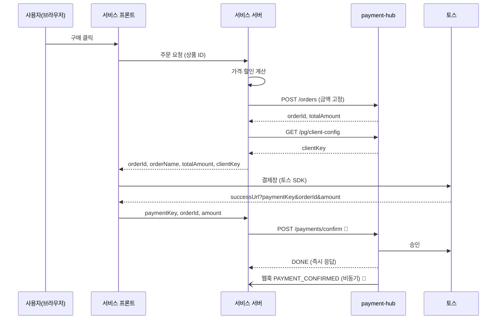

# 서비스 연동 가이드

> **대상**: payment-hub에 결제를 붙이는 각 서비스의 백엔드·프론트엔드 개발자
> **함께 볼 것**: API 계약 [docs/api.md](../api.md) · OpenAPI [docs/openapi.json](../openapi.json) · 예제 코드 [examples/](../../examples)
> 이 가이드의 예제 코드(`examples/`)는 실제 hub에 붙여 자동 테스트된다 (`test/docs/`).

## 목차

1. [먼저 알아둘 것](#1-먼저-알아둘-것)
2. [준비물 받기](#2-준비물-받기)
3. [호출 공통 규칙](#3-호출-공통-규칙)
4. [연결 확인](#4-연결-확인)
5. [일반 결제 흐름](#5-일반-결제-흐름)
6. [정기결제·환불](#6-정기결제환불)
7. [웹훅 수신 구현](#7-웹훅-수신-구현)
8. [에러 코드별 대응](#8-에러-코드별-대응)
9. [운영 전 체크리스트](#9-운영-전-체크리스트)

---

## 1. 먼저 알아둘 것

**hub는 결제만 한다.** 상품·가격·할인·구독 주기·환불 금액 계산은 서비스가 하고, hub에는 계산 결과만 보낸다.

| 서비스가 하는 일 | hub가 하는 일 |
|---|---|
| 상품·할인·결제 금액 계산 | 금액 합계 검증, 결제 전 금액 고정 |
| 결제창 띄우기 (토스 SDK) | 토스 승인·취소·조회 호출, 토스 시크릿 키 보관 |
| 결제 후 처리 (이용권 지급 등) | 결제 기록, 원장 기장, 결제 이벤트 웹훅 발송 |
| 환불 금액 계산, 환불 요청 | 환불 가능 금액 검증, 토스 취소 |
| 정기결제 일정·재시도 판단 | 요청받은 자동결제 실행 |

**현재 구현 상태** — ✅ 지금 연동 가능 · 🚧 계약 확정, 구현 예정 (요청·응답은 [api.md](../api.md) 그대로 구현된다)

| 기능 | API | 상태 |
|---|---|---|
| 연결 확인 | `GET /me` | ✅ |
| 결제창 설정 | `GET /pg/client-config` | ✅ |
| 주문 등록·조회 | `POST /orders`, `GET /orders`, `GET /orders/:id` | ✅ |
| 결제 승인·조회·환불 | `POST /payments/confirm`, `GET /payments`, `POST /payments/:id/cancel` … | 🚧 |
| 정기결제·빌링키 | `POST /payments/billing`, `/billing-keys` | 🚧 |
| 웹훅 발송 | hub → 서비스 | 🚧 (서명 규격·검증 코드는 확정 ✅) |

---

## 2. 준비물 받기

payment-hub 관리자(admin)에게 아래 값을 받는다. **API 키와 웹훅 서명 키는 발급 시 한 번만 보여지므로** 받은 즉시 서버 비밀 저장소에 넣는다.

| 값 | 예 | 보관 위치 | 용도 |
|---|---|---|---|
| hub URL | `https://payment-hub.internal` | 서버 env | API 호출 |
| 서비스 API 키 | `ph_live_4Jt9…` | **서버 env만** (프론트 금지) | 모든 API 호출의 `Authorization` |
| 웹훅 서명 키 | `whsec_9f2c…` | **서버 env만** | 웹훅 진위 확인 |
| 상품 유형 코드 | `PLAN`, `ADDON` | 코드 상수 | 주문 항목의 `productType` |

- 키 prefix로 환경을 구분한다: `ph_test_` = 테스트 hub(토스 테스트 결제), `ph_live_` = 운영 hub(실제 결제)
- 테스트 hub와 운영 hub는 **URL도 DB도 다르다.** 테스트 결제는 운영 데이터에 절대 섞이지 않는다

### 로컬에서 바로 시작하기

hub 레포를 받아 로컬 hub를 띄우고, 스크립트로 테스트 서비스를 만든다.

```bash
# hub 레포에서
npm install && cp .env.example .env
echo "ENCRYPTION_KEYS=v1:$(node -e "console.log(require('crypto').randomBytes(32).toString('base64'))")" >> .env
npm run admin-key:generate            # 출력된 ADMIN_API_KEY_HASHES=... 를 .env에 추가, 평문 키는 메모
npm run db:up && npm run start:dev

# 다른 터미널에서 — 서비스·상품 유형·토스 테스트 키·API 키를 한 번에 준비
HUB_URL=http://localhost:3000 \
ADMIN_API_KEY=phadm_...(위에서 메모한 평문) \
TOSS_CLIENT_KEY=test_ck_...  TOSS_SECRET_KEY=test_sk_...   # 토스 개발자센터의 테스트 키
WEBHOOK_URL=http://localhost:4000/webhooks/payment-hub \
npm run local:onboard
```

출력된 `PAYMENT_HUB_URL`, `PAYMENT_HUB_API_KEY`, `PAYMENT_HUB_WEBHOOK_SECRET`을 서비스 서버 `.env`에 넣으면 끝이다.
TEST hub는 로컬 개발을 위해 `http://localhost` 웹훅 URL을 허용한다 (운영은 https만).

---

## 3. 호출 공통 규칙

### 요청

```http
POST /api/v1/orders
Authorization: Bearer ph_test_xxxxxxxx
Content-Type: application/json
```

- 서버 간 호출 전용이다. **API 키를 브라우저·앱에 넣지 않는다** (CORS도 막혀 있다)
- 금액은 **정수, 통화 최소 단위**: 10,000원 = `10000`
- 시간은 ISO 8601 UTC

### 응답

```jsonc
// 성공
{ "success": true, "message": "주문이 등록되었습니다.", "data": { /* 결과 */ } }

// 실패 — code로 분기하고 message는 로그·사용자 안내용
{ "success": false, "code": "ORDER_AMOUNT_INVALID", "message": "주문 항목 합계와 주문 금액이 일치하지 않습니다.",
  "detail": { "originalAmount": 35000, "expectedTotalAmount": 30000, "totalAmount": 31000 } }
```

- **`code`는 바뀌지 않는 식별자**다. 분기는 항상 `code`로 한다 (message 문구는 바뀔 수 있음)
- 검증 실패(`INVALID_REQUEST`)는 `detail.errors = [{ field, message }]`
- 목록은 `data = { data: [...], totalCount, nextCursor }`. 다음 페이지는 `?cursor=<nextCursor>`, 마지막이면 `nextCursor = null`

### 타임아웃과 재시도 — 멱등키

네트워크 오류·타임아웃이면 **같은 멱등키로 다시 보내면 된다.** 이미 처리된 요청이면 에러가 아니라 기존 결과가 온다.

| 요청 | 멱등키 | 재시도 결과 |
|---|---|---|
| 주문 등록 | `externalOrderId` | 같은 내용이면 기존 주문 `200` (새로 만들면 `201`) / 다르면 `409` |
| 결제 승인 🚧 | `paymentKey` | 기존 결과 |
| 자동결제 🚧 | `idempotencyKey` | 기존 결과 |
| 환불 🚧 | `idempotencyKey` | 기존 결과 |

권장: 타임아웃 10초, 5xx·네트워크 오류는 지수 백오프로 최대 3회 재시도, 4xx는 재시도하지 않는다.
단, **결제 승인의 `504 PG_TIMEOUT`은 재시도 대상이 아니다** — 결과 확인 중이라는 뜻이므로 조회나 웹훅을 기다린다.

### 예제 클라이언트

[examples/service-client.ts](../../examples/service-client.ts) · [examples/http.ts](../../examples/http.ts) — 내장 `fetch`만 사용. 그대로 복사하거나 참고한다.

```ts
import { PaymentHubServiceClient } from './payment-hub/service-client';
import { PaymentHubError } from './payment-hub/http';

export const paymentHub = new PaymentHubServiceClient({
  baseUrl: process.env.PAYMENT_HUB_URL!,
  apiKey: process.env.PAYMENT_HUB_API_KEY!,
});
```

다른 언어는 [docs/openapi.json](../openapi.json)으로 클라이언트를 생성할 수 있다 (예: `npx openapi-typescript docs/openapi.json -o payment-hub.d.ts`).
OpenAPI 스키마는 응답의 `data` 부분만 표현한다 — 실제 응답은 위의 `{ success, message, data }`로 감싸져 있다.

---

## 4. 연결 확인

키를 받거나 교체한 뒤, 배포 직후 헬스체크로 호출한다.

```ts
const me = await paymentHub.me();
// { serviceId: '0b6f…', code: 'SVC_A', name: '서비스 A', status: 'ACTIVE' }
```

| 응답 | 의미 | 할 일 |
|---|---|---|
| `401 UNAUTHORIZED` | 키가 없거나 틀림 | env 값·`Bearer ` 접두어 확인 |
| `401 API_KEY_REVOKED` / `API_KEY_EXPIRED` | 폐기·만료된 키 | admin에게 새 키 요청 |
| `403 SERVICE_SUSPENDED` | 서비스가 정지됨 | admin 문의 |

---

## 5. 일반 결제 흐름



### 5.1 주문 등록 ✅ (서비스 서버)

가격·할인을 **서버에서** 계산해 등록한다. 프론트가 보낸 금액을 그대로 쓰지 않는다.

```ts
const { order } = await paymentHub.createOrder({
  externalOrderId: myOrder.id,            // 서비스 주문번호. 재시도할 때 같은 값
  externalUserId: user.id,
  orderName: '프로 요금제 1개월 외 1건',  // 결제창 표시 (100자 이하)
  items: [
    { productType: 'PLAN',  externalProductId: 'pro-monthly', productName: '프로 요금제 1개월', unitPrice: 29000, quantity: 1 },
    { productType: 'ADDON', externalProductId: 'storage-10g', productName: '추가 저장공간',     unitPrice: 3000,  quantity: 2 },
  ],
  discountType: 'COUPON_WELCOME',
  discountAmount: 5000,
  totalAmount: 30000,                     // = 29000 + 6000 − 5000
  expiresInSeconds: 1800,                 // 이 시간 안에 결제 승인까지 끝나야 함
});
// order.orderId → 토스 결제창의 orderId
```

- `totalAmount ≠ 항목 합계 − 할인`이면 `400 ORDER_AMOUNT_INVALID` (`detail`에 계산값)
- 등록 안 된·중지된 `productType`이면 `400 PRODUCT_TYPE_NOT_ALLOWED` (`detail.productTypes`) → admin에게 상품 유형 등록 요청

### 5.2 결제창 띄우기 (서비스 프론트)

`GET /pg/client-config`로 받은 `clientKey`와 주문 정보로 토스 결제창을 띄운다. 아래는 토스페이먼츠 JavaScript SDK v2 기준 예시다 (SDK 사용법은 [토스 공식 문서](https://docs.tosspayments.com)를 따른다).

```js
const tossPayments = TossPayments(clientKey);
const payment = tossPayments.payment({ customerKey: TossPayments.ANONYMOUS });

await payment.requestPayment({
  method: 'CARD',
  amount: { currency: 'KRW', value: order.totalAmount },
  orderId: order.orderId,            // hub가 준 orderId
  orderName: order.orderName,
  successUrl: 'https://svc.example.com/pay/success',
  failUrl: 'https://svc.example.com/pay/fail',
});
```

### 5.3 결제 승인 🚧 (서비스 서버)

`successUrl`로 돌아온 `paymentKey`, `orderId`, `amount`를 **서비스 서버**가 hub에 보낸다. hub가 주문 금액과 대조하므로 URL의 amount를 조작해도 결제되지 않는다.
요청·응답·에러는 [api.md 3.3](../api.md#33-결제) 참고.

### 5.4 결제 후 처리

응답(`DONE`)을 받으면 사용자에게 완료 화면을 보여주고, **이용권 지급 같은 후속 처리는 웹훅 `PAYMENT_CONFIRMED`를 기준으로** 한다.
응답과 웹훅 중 먼저 온 쪽에서 처리하되 `paymentId` 기준으로 한 번만 처리되게 만든다.
가상계좌는 응답이 `WAITING_FOR_DEPOSIT`이고, 입금되면 `PAYMENT_CONFIRMED` 웹훅이 온다.

---

## 6. 정기결제·환불

계약은 확정, 구현 예정 🚧. 흐름만 먼저 설계에 반영해 둔다.

- **정기결제**: 사용자 카드 등록(빌링키) → 서비스 배치가 결제일·재시도를 판단 → `POST /orders` → `POST /payments/billing { orderId, billingKeyId, idempotencyKey }`. 멱등키는 `구독ID-결제회차`처럼 재시도에도 같은 값
- **환불**: `GET /payments/:id/refundable`로 환불 가능 금액 확인 → 서비스가 금액 계산(일할 등) → `POST /payments/:id/cancel { amount, reasonCode, idempotencyKey, items? }`
- **후속 처리 실패 시 hub는 자동 환불하지 않는다.** 이용권 지급이 실패하면 서비스가 판단해 환불 API를 호출한다

---

## 7. 웹훅 수신 구현

hub는 결제 상태가 바뀌면 서비스의 `webhookUrl`로 `POST`한다. 서명 규격과 검증 코드는 확정되어 있다 (hub 발송은 🚧).

### 7.1 요청 형식

```http
POST /webhooks/payment-hub
Content-Type: application/json
X-PaymentHub-Event-Id: d4e5…
X-PaymentHub-Timestamp: 1790470563
X-PaymentHub-Signature: v1=5f0c…(hex)

{ "eventId": "d4e5…", "eventType": "PAYMENT_CONFIRMED", "occurredAt": "…", "data": { "paymentId": "…", "orderId": "…", "externalOrderId": "…", "status": "DONE", "amount": 30000 } }
```

서명 = `v1=` + hex(HMAC-SHA256(웹훅 서명 키, `"<타임스탬프>.<본문 원문>"`))

### 7.2 검증 코드

[examples/webhook-signature-verify.ts](../../examples/webhook-signature-verify.ts)를 복사해 쓴다 (Node 내장 `crypto`만 사용, hub 서명과 맞는지 자동 테스트됨).
**본문은 JSON 파싱 전 원문으로 검증해야 한다.** Express 예:

```ts
import express from 'express';
import { verifyPaymentHubWebhook } from './payment-hub/webhook-signature-verify';

app.post('/webhooks/payment-hub', express.raw({ type: 'application/json' }), async (req, res) => {
  const rawBody = req.body.toString('utf8');
  const result = verifyPaymentHubWebhook({ secret: process.env.PAYMENT_HUB_WEBHOOK_SECRET!, rawBody, headers: req.headers });
  if (!result.ok) return res.status(401).json({ reason: result.reason });

  // 1) 같은 이벤트가 여러 번 올 수 있다 → eventId로 중복 제거 (DB 유니크 키 권장)
  if (await processedEvents.exists(result.eventId)) return res.sendStatus(200);

  // 2) 빨리 2xx를 응답하고 무거운 일은 큐로 넘긴다
  await queue.enqueue(JSON.parse(rawBody));
  await processedEvents.save(result.eventId);
  return res.sendStatus(200);
});
```

| 검증 결과 | 의미 |
|---|---|
| `MISSING_HEADER` | hub가 보낸 요청이 아님 |
| `STALE_TIMESTAMP` | 5분보다 오래됨 → 재전송 공격 가능성 |
| `INVALID_SIGNATURE` | 서명 키가 다르거나 본문이 변조됨. **서명 키 교체 직후라면 env 갱신 확인** |

### 7.3 전달 보장

- 2xx가 아니면 hub가 **지수 백오프로 재시도**한다. 한도를 넘으면 `DEAD`가 되고 admin이 재전송할 수 있다
- 순서는 보장되지 않는다. 처리 전에 `GET /payments/:id`로 최신 상태를 확인하는 것이 가장 안전하다
- 놓친 이벤트는 `GET /events?after=<eventId>` 🚧로 따라잡는다

| `eventType` | 서비스가 할 일 |
|---|---|
| `PAYMENT_CONFIRMED` | 이용권 지급 등 후속 처리 |
| `PAYMENT_WAITING_FOR_DEPOSIT` | 가상계좌 입금 안내 |
| `PAYMENT_FAILED` | 결제 실패 안내, 재결제 유도 |
| `PAYMENT_CANCELED` | 이용권 회수 등 (부분 환불이면 `data.refundedAmount` 확인) |
| `ORDER_EXPIRED` | 주문 만료 처리 |

---

## 8. 에러 코드별 대응

전체 목록은 [api.md 1.3](../api.md#13-응답-형식) → CLAUDE.md 에러 코드 표.

| code | status | 원인 | 서비스 대응 |
|---|---|---|---|
| `INVALID_REQUEST` | 400 | 요청 형식 오류 | `detail.errors`의 필드 수정. 재시도 금지 |
| `UNAUTHORIZED` | 401 | 키 없음·틀림·삭제된 서비스 | env 확인 |
| `API_KEY_REVOKED` / `API_KEY_EXPIRED` | 401 | 폐기·만료 키 | 새 키로 교체 |
| `SERVICE_SUSPENDED` | 403 | 서비스 정지 | admin 문의. 사용자에게 결제 일시 중단 안내 |
| `PRODUCT_TYPE_NOT_ALLOWED` | 400 | 미등록·중지된 상품 유형 | admin에게 등록 요청 |
| `ORDER_AMOUNT_INVALID` | 400 | 금액 합계 불일치 | 서비스 금액 계산 버그. `detail` 확인 |
| `ORDER_IDEMPOTENCY_CONFLICT` | 409 | 같은 주문번호로 다른 내용 | 주문번호 생성 로직 확인 (재사용 금지) |
| `ORDER_NOT_FOUND` | 404 | 없는 주문·다른 서비스 주문 | orderId 확인 |
| `ORDER_EXPIRED` | 409 | 결제 가능 시간 초과 | 새 주문 등록 후 다시 결제 |
| `PAYMENT_AMOUNT_MISMATCH` | 400 | 승인 금액 ≠ 주문 금액 | 변조 의심. 결제 중단 |
| `PAYMENT_IN_PROGRESS` | 409 | 같은 주문 결제 처리 중 | 잠시 후 결과 조회 |
| `PG_CREDENTIAL_NOT_FOUND` | 500 | hub에 토스 키 미등록 | admin 문의 |
| `PG_TIMEOUT` | 504 | 토스 응답 지연 | **재시도 금지.** 조회·웹훅으로 결과 확인 |
| `PG_ERROR` | 502 | 토스 거절 등 | `detail.pgMessage`를 사용자에게 안내 (카드 한도 초과 등) |
| `INTERNAL_ERROR` | 500 | hub 내부 오류 | 백오프 후 재시도, 계속되면 문의 |

---

## 9. 운영 전 체크리스트

- [ ] API 키·웹훅 서명 키가 서버 env에만 있고, 로그·프론트·저장소에 없다
- [ ] 금액은 서버에서 계산해 주문 등록하고, 프론트 금액을 신뢰하지 않는다
- [ ] `externalOrderId`는 주문마다 유일하고, 재시도 시 같은 값을 쓴다
- [ ] 에러 분기는 `code`로 한다
- [ ] 웹훅: 원문 본문으로 서명 검증, `eventId` 중복 제거, 빠른 2xx 응답
- [ ] 이용권 지급은 `paymentId` 기준으로 한 번만 된다 (응답·웹훅 중복 대비)
- [ ] `GET /me`를 배포 헬스체크에 넣었다
- [ ] 운영 키(`ph_live_`)는 운영 hub URL과 짝이 맞다
